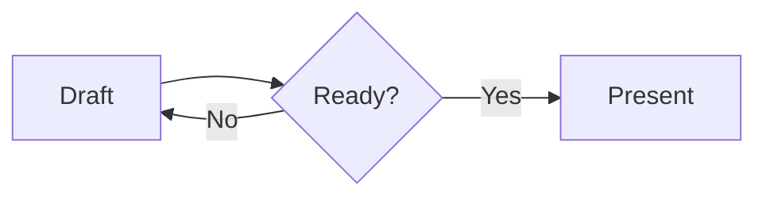

# Runtime Customization

Use this reference when wiring a SuperDeck Flutter app, assets, styles, templates, custom widgets, slide parts, or plugins.

## Minimal App Setup

SuperDeck apps must initialize before `runApp`:

```dart
import 'package:flutter/widgets.dart';
import 'package:superdeck/superdeck.dart';

Future<void> main() async {
  WidgetsFlutterBinding.ensureInitialized();
  await SuperDeckApp.initialize();

  runApp(const SuperDeckApp(options: DeckOptions()));
}
```

The CLI expects `slides.md` at the project root. Build output lives in `.superdeck/`.

Typical setup:

```bash
dart pub global activate superdeck_cli
flutter create my_presentation
cd my_presentation
superdeck setup
flutter pub add superdeck
flutter pub add --dev superdeck_cli
dart run superdeck_cli:main build --watch
flutter run
```

`superdeck setup` creates `.superdeck/`, adds `.superdeck/` to `flutter.assets`, and patches macOS entitlements when a macOS runner exists.

## DeckOptions

`DeckOptions` configures the runtime:

```dart
DeckOptions(
  baseStyle: myBaseStyle,
  styles: {
    'quote': quoteStyle(),
  },
  widgets: {
    'metricCard': MetricCard.new,
  },
  parts: const SlideParts(
    header: DeckHeader(),
    footer: DeckFooter(),
    background: DeckBackground(),
  ),
  templates: {
    'brand': SlideTemplate(
      parts: SlideParts(header: BrandHeader()),
      baseStyle: brandStyle,
      styles: {'cover': coverStyle},
    ),
  },
  defaultTemplate: SlideTemplate(parts: SlideParts(footer: BrandFooter())),
  debug: true,
)
```

There is no `styles.yaml`; styles and templates are Dart code.

## Custom Widgets

A widget factory is `Widget Function(Map<String, Object?> args)`.

```dart
import 'package:flutter/widgets.dart';
import 'package:superdeck/superdeck.dart';

class MetricCard extends StatelessWidget {
  final String label;
  final String value;

  MetricCard(Map<String, Object?> args, {super.key})
    : label = args['label'] as String? ?? '',
      value = args['value'] as String? ?? '';

  @override
  Widget build(BuildContext context) {
    return Center(child: Text('$label: $value'));
  }
}

SuperDeckApp(
  options: DeckOptions(
    widgets: {
      'metricCard': MetricCard.new,
    },
  ),
);
```

For non-trivial widgets, parse arguments into a typed shape and validate early. `Ack` is available from `package:superdeck_core/superdeck_core.dart`.

Widget blocks can read slide context:

```dart
final slide = SlideConfiguration.of(context);
final title = slide.options.title;
final index = slide.slideIndex;
final args = slide.options.args;
```

Use Flutter's `LayoutBuilder` for sizing. SuperDeck does not export a public `MeasureSize` API.

If a widget factory is missing, SuperDeck renders `Widget not found: <name>`. If the factory throws, SuperDeck renders error details on the slide.

Built-ins `image`, `dartpad`, `webview`, and `qrcode` are registered first. User widgets with the same name override a built-in only when that name is used by the slide.

### Recommended Custom Widget Pattern

Use a typed args object for anything beyond trivial text. This keeps slide authoring errors readable because SuperDeck catches factory exceptions and renders them on the slide.

```dart
import 'package:flutter/widgets.dart';
import 'package:superdeck/superdeck.dart';
import 'package:superdeck_core/superdeck_core.dart';

class MetricCardArgs {
  const MetricCardArgs({
    required this.label,
    required this.value,
    this.trend,
  });

  final String label;
  final String value;
  final String? trend;

  static final schema = Ack.object({
    'label': Ack.string().notEmpty(),
    'value': Ack.string().notEmpty(),
    'trend': Ack.string().optional(),
  });

  static MetricCardArgs parse(Map<String, Object?> args) {
    schema.parse(args);
    return MetricCardArgs(
      label: args['label'] as String,
      value: args['value'] as String,
      trend: args['trend'] as String?,
    );
  }
}

class MetricCard extends StatelessWidget {
  final MetricCardArgs data;

  MetricCard(Map<String, Object?> args, {super.key})
    : data = MetricCardArgs.parse(args);

  @override
  Widget build(BuildContext context) {
    return LayoutBuilder(
      builder: (context, constraints) {
        return SizedBox(
          width: constraints.maxWidth,
          height: constraints.maxHeight,
          child: Center(child: Text('${data.label}: ${data.value}')),
        );
      },
    );
  }
}
```

### Ack-Generated Args Wrappers

Ack can also generate immutable typed models from a top-level schema. This
avoids maintaining a manual args class while preserving SuperDeck's widget
factory contract: the factory still receives `Map<String, Object?> args` and
the generated model validates it at the boundary.

Use this pattern only when the target app already has Ack codegen configured, or when you are intentionally adding it:

```bash
dart pub add ack ack_annotations
dart pub add --dev ack_generator build_runner
```

Keep Ack package versions aligned with the app's existing dependency policy. In the SuperDeck repo, match the pinned Ack versions in the package you are editing; playground schemas show the pattern in `packages/playground/lib/features/ai/quick_agent/core/engine/schemas/deck_schemas.dart`.

```dart
import 'package:ack/ack.dart';
import 'package:ack_annotations/ack_annotations.dart';
import 'package:flutter/widgets.dart';
import 'package:superdeck/superdeck.dart';

part 'metric_card.ack.dart';
part 'metric_card.ack.g.dart';

@AckInfer()
final metricCardArgsSchema = Ack.object({
  'label': Ack.string().notEmpty(),
  'value': Ack.string().notEmpty(),
  'trend': Ack.string().optional(),
});

class MetricCard extends StatelessWidget {
  final MetricCardArgs data;

  MetricCard(Map<String, Object?> args, {super.key})
    : data = MetricCardArgs.parse(args);

  @override
  Widget build(BuildContext context) {
    return Center(child: Text('${data.label}: ${data.value}'));
  }
}
```

Generate the wrapper after schema changes:

```bash
dart run build_runner build --delete-conflicting-outputs
```

Ack generation constraints that matter for SuperDeck widgets:

- Annotate top-level schema variables or getters with `@AckInfer()` and include
  both generated part files.
- Let Ack derive the model name when the schema declaration already expresses
  it (`metricCardArgsSchema` generates `MetricCardArgs`). Use `name:` only when
  the desired public type cannot be derived from the declaration.
- Generated immutable models expose `parse`, `safeParse`, `fromJson`, `toJson`,
  and typed fields.
- Nested object fields should reference named top-level schemas when you need typed nested getters.
- Do not expect `Ack.any()`/`Ack.anyOf()` or inline anonymous object branches to generate useful typed wrappers.
- Keep `align`, `flex`, `margin`, `padding`, `scrollable`, and `name` out of
  widget-specific schemas because SuperDeck consumes those reserved block keys
  before calling the factory.

Register it:

```dart
SuperDeckApp(
  options: DeckOptions(
    widgets: {
      'metricCard': MetricCard.new,
    },
  ),
);
```

Use it:

```markdown
@metricCard {
  label: Activation
  value: "72%"
  trend: up
  align: center
}
```

Notes:

- `align`, `flex`, `margin`, `padding`, `scrollable`, and `name` are reserved
  block keys; do not expect them inside `args`.
- Widget names can include letters, digits, underscores, and hyphens because directive tags match `@[\w-]+`.
- A custom widget can override a built-in by registering `image`, `dartpad`, `webview`, or `qrcode`, but do that only intentionally.
- Use `SlideConfiguration.of(context)` for slide metadata and `LayoutBuilder` for block size.

## Slide Parts

Use slide parts for shared chrome:

- Header: `PreferredSizeWidget`
- Footer: `PreferredSizeWidget`
- Background: `Widget`

```dart
class DeckHeader extends StatelessWidget implements PreferredSizeWidget {
  const DeckHeader({super.key});

  @override
  Size get preferredSize => const Size.fromHeight(56);

  @override
  Widget build(BuildContext context) {
    final slide = SlideConfiguration.of(context);
    return Align(
      alignment: Alignment.centerLeft,
      child: Text(slide.options.title ?? ''),
    );
  }
}
```

Header and footer consume vertical space from the 1280x720 slide content area. Background fills the full slide.

Set `layout: fullscreen` in a slide's front matter to remove the resolved header and footer for that slide. This affects deck parts, named-template parts, and `defaultTemplate` parts, but preserves the resolved background and style.

## Styles and Templates

Slide frontmatter selects styles/templates:

```markdown
---
style: cover
template: brand
---
```

Resolution order:

- With a template: `defaultSlideStyle -> template.baseStyle -> template.styles[style]`.
- Without a template: `defaultSlideStyle -> options.baseStyle -> options.styles[style]`.
- `defaultTemplate` applies when a slide has no explicit `template`.
- `template: none` opts out of `defaultTemplate`.

Unknown templates or styles throw `ArgumentError` during configuration build, so verify names.

Template styles are isolated. A slide using `template: brand` and `style: cover` looks up `cover` in `SlideTemplate.styles`, not `DeckOptions.styles`.

### `blockContainer` and `BlockStyler`

`SlideStyler.blockContainer` is a `BlockStyler`, not a `BoxStyler`. `BlockStyler`
is a constrained Mix styler exposing only `padding`, `margin` (plus Mix
spacing convenience methods), `decoration`, `foregroundDecoration`,
`clipBehavior`, context/`BlockVariant` variants, and animation. It cannot
express widget modifiers, width/height/constraints, transforms, or box
alignment — block/section `align` owns content placement, and section
`spacing` plus flex own geometry. Use `BoxStyler` for other style slots
(`slideContainer`, code block containers, alert containers); those are
unaffected by this constraint.

### Named Widget Block Styles

Use `BlockVariant` to target every widget block with an exact, case-sensitive name. The selector resolves around the matching block container and its descendants, so container padding/margin and widget subtree styles see the same active variant.

```dart
import 'package:mix/mix.dart';
import 'package:superdeck/superdeck.dart';

const webviewBlock = BlockVariant('webview');

final options = DeckOptions(
  baseStyle: SlideStyler(
    blockContainer: BlockStyler(
      padding: EdgeInsetsGeometryMix.all(40),
    ).variants([
      VariantStyle(
        webviewBlock,
        BlockStyler(padding: EdgeInsetsGeometryMix.all(0)),
      ),
    ]),
  ),
);
```

`BlockVariant('webview')` matches `@webview` and `@widget { name: "webview" }`; `BlockVariant('chart')` matches `@chart`. It does not select Markdown `@block` content, arbitrary `NamedVariant` values, or individual instances. SuperDeck already applies a zero-padding, zero-margin `BlockVariant('webview')` rule by default, so WebView blocks are edge-to-edge unless the style overrides it.

A Markdown block-level `margin` or `padding` value applies after these Mix
variants resolve. It replaces only the matching inset; the other inset,
decoration, border, animation, and the active selector remain intact. An
absent (`null`) override inherits the resolved style value; an explicit `0`
removes it.

## Images and Assets

The CLI manages `.superdeck/` assets and ensures this entry exists unless `--skip-pubspec` is used:

```yaml
flutter:
  assets:
    - .superdeck/
```

Project-owned image files such as `assets/logo.png` still need to be available to Flutter:

- Native debug runtimes can load relative paths from the filesystem.
- Web/release/static rendering falls back to Flutter `AssetImage`, so declare project asset directories in `pubspec.yaml`.
- URLs use cached network loading.
- `file://` and absolute paths are supported for author-controlled `@image` sources, but they are not portable for deployed web decks.

Markdown images (``) use `UriValidator` and reject unsupported schemes such as `asset:`, `data:`, and path traversal (`..`) segments. `@image` parses author-controlled YAML more permissively and supports `data:` URIs through the image provider.

Bare image keys with no scheme and no path separators, such as `slide-intro.png`, can resolve through a bound `AssetCacheStore`; this is mainly used by generated/in-memory decks.

## Plugins

Use custom widgets for slide content that renders directly in Flutter. Use
plugins when the capability needs shell actions or build-time transforms.

Runtime plugin example: PDF export.

```dart
import 'package:superdeck_pdf/superdeck_pdf.dart';

SuperDeckApp(
  options: DeckOptions(),
  plugins: const [PdfPlugin()],
)
```

Mermaid diagrams render directly from fenced `mermaid` blocks. They do not
require a plugin, custom runner, browser, generated image, or cache:

````markdown

````

Supported diagrams are flowcharts, sequence diagrams, pie charts, Gantt
charts, timelines, Kanban boards, radar charts, and XY charts. Unsupported or
invalid syntax displays an inline error in the slide. The diagram background is
transparent, and its colors follow the app's light or dark Flutter theme.

## DartPad Sharing

SuperDeck's `@dartpad` widget accepts the DartPad gist ID, not a full URL. The runtime builds a URL like:

```text
https://dartpad.dev/?id=<id>&theme=<theme>&embed=<embed>&run=<run>
```

To create a shareable DartPad for a deck:

1. Create a GitHub Gist with a `main.dart` file.
2. Copy the gist ID from the gist URL.
3. Verify `https://dartpad.dev/?id=<gist-id>` loads the snippet.
4. Use that gist ID in `slides.md`:

```markdown
@dartpad {
  id: "5c0e154dd50af4a9ac856908061291bc"
  theme: dark
  embed: true
  run: true
}
```

Use `run: false` for exercises where the audience should edit before running.

## WebView Runtime

`@dartpad` and `@webview` render through `WebViewWrapper`. Live controllers are cached at deck scope by the block runtime key or an explicit `cacheKey`; reuse is sequential, not concurrent. Static rendering produces a placeholder instead of creating a controller.

Behavior:

- Creates a `webview_flutter` `WebViewController`.
- Enables `JavaScriptMode.unrestricted` because DartPad requires JavaScript.
- Loads the generated DartPad URL from `DartPadDto.toUrl()` or the validated `@webview` URL.
- Allows navigation only to the source host by default; `@webview.allowedHosts` can extend the list. Flutter web cannot enforce this policy because its iframe implementation does not expose navigation callbacks.
- Hides the WebView initially, then fades it in after `onPageFinished` plus a 500 ms delay.
- Reuses a cached controller when remounting the same key and URL, and reloads when the URL changes.
- Displays overlay icon buttons for refresh and clearing the CodeMirror editor.

Platform notes:

- The package depends on `webview_flutter` and `webview_flutter_web`.
- `superdeck setup` patches macOS network entitlements when a macOS runner exists; run it for desktop decks using DartPad or WebView.
- Embedded DartPad needs network access to `dartpad.dev`; embedded pages need network access to their configured URL.
- Because navigation is host-restricted on native targets, use surrounding slide content for external links instead of expecting WebView navigation to arbitrary domains.

## Deployment Notes

SuperDeck deploys as a normal Flutter web app. For GitHub Pages, remember:

```bash
dart run superdeck_cli:main build
flutter build web --release --base-href "/<repo>/"
touch build/web/.nojekyll
```

The `.nojekyll` file prevents Pages from dropping Flutter's `_flutter/` directory.
