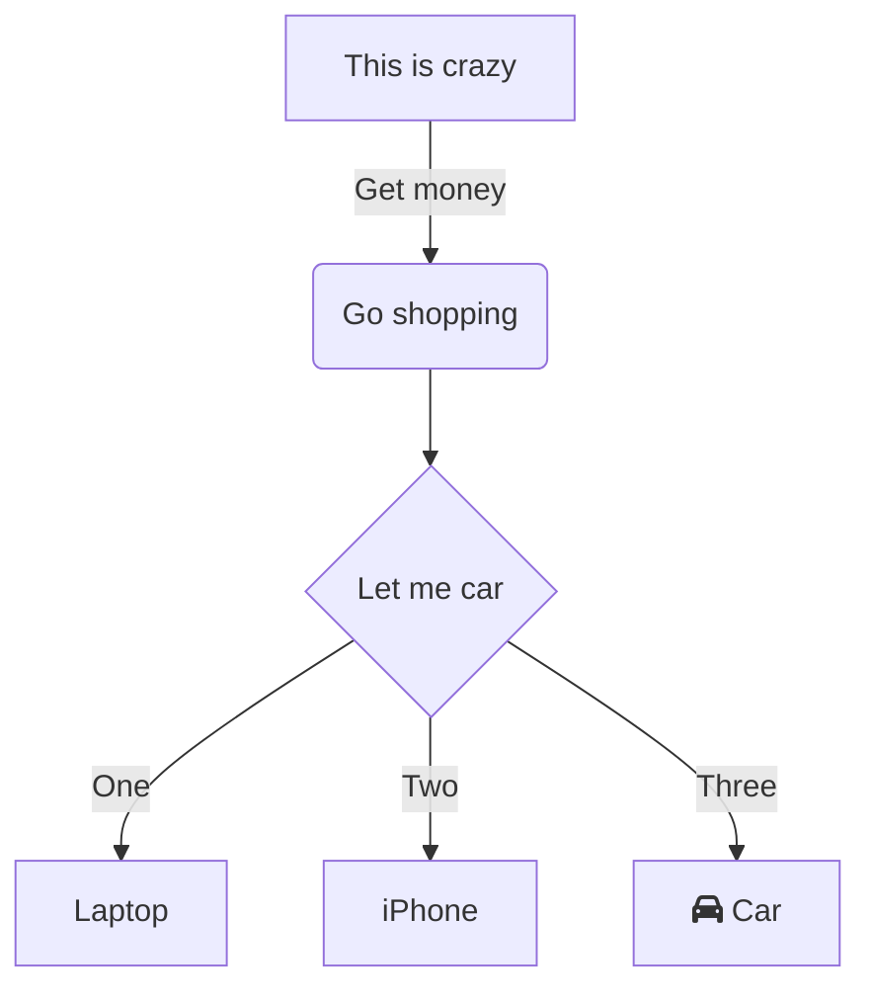

 # SUPERDECK 
 ## RELEASED! 🎉

 #### Create beautiful Flutter
 #### slides with Markdown


---
style: cover
layout: two_column
background: https://source.unsplash.com/person-discussing-while-standing-in-front-of-a-large-screen-in-front-of-people-inside-dim-lighted-room-bzdhc5b3Bxs
sections:
  left:
    flex: 2
    alignment: center_left
  right:
    alignment: bottom_right
    flex: 1
---

::left::
 
## Making your Flutter presentations easier than ever.

::right::
#### For Flutter developers. Made with ❤️ Flutter.

---
style: quote
layout: image
options:
  src: https://source.unsplash.com/people-watching-concert-during-night-time-blgOFmPIlr0
  fit: cover
content:
  alignment: bottom_right
---


> Create your Flutter presentations faster and easier than ever.
> You can quote me on that.
> ### Leo Farias


---
background: https://media.giphy.com/media/v1.Y2lkPTc5MGI3NjExZGt1MnQ5N2k3cXVma24wb3V5cThlZ3ExY2NvY3czcmozang0bGQ1ZSZlcD12MV9pbnRlcm5hbF9naWZfYnlfaWQmY3Q9Zw/XzWd8acQ37byKR4tmd/giphy.gif
style: cover
---

# Complex layouts

---
layout: image
style: show_sections
options:
  src: https://source.unsplash.com/random/900×700/?waves
  fit: cover
  position: left
  flex: 1
---

# Image Layout

Create beautiful slides with images that fit your content.

##### Options
```yaml
options:
  src: https//www.url.com/image.jpg
  fit: cover
  position: left
  flex: 1
```

> Define position fit and flex options for the image.


---
layout: two_column
style: show_sections
sections:
  left:
    flex: 2
  right:
    alignment: bottom_left
---

::left::

# Two Column

This is a two-column layout. You can use it to compare two different concepts or ideas.

::right::

### Section Options

Easily customize the content of each section to suit your needs.

Use front matter to define the layout of each section


```yaml
sections:
  left:
    flex: 2
  right:
    alignment: bottom_left
```

---
layout: two_column_header
content:
  alignment: center
  flex: 2
sections:
  left:
    flex: 2
  right:
    alignment: bottom_left
  header:
    alignment: bottom_left
style: show_sections
---

# Two Column + Header


::left::

### Left Section
Easily customize the content of each section to suit your needs.

Use front matter to define the layout of each section
::right::

#### Section Options

```yaml
sections:
  left:
    alignment: bottom_right
    flex: 2
  right:
    alignment: bottom_left
  header:
    alignment: bottom_left
```
 

---
style: rad
layout: two_column
content:
  alignment: center
sections:
  left:
  right:
    alignment: bottom_left
    flex: 2
---

# Mix

Integration with Mix gives you complete control over all styling elements in your slides with a simple and intuitive API.

::right::

```dart
VariantAttribute get radStyle {
  return const SlideVariant('rad')(
    $.h1.textStyle.as(GoogleFonts.poppins()),
    $.h1.textStyle.fontSize(140),
    $.code.decoration.border.all(
      color: Colors.red,
      width: 3,
    ),
    $.code.decoration(
      color: Colors.black54,
    ),
    $.code.padding.all(40),

    $.outerContainer.margin.all(60),

    $.innerContainer.borderRadius(25),
    $.innerContainer.shadow(
      blurRadius: 0,
      spreadRadius: 10,
      color: Colors.red.withOpacity(1),
    ),
    $.innerContainer.gradient.radial(
      stops: [0.0, 1.0],
      radius: 0.7,
      colors: [Colors.purple, Colors.deepPurple],
    ),

    // Events
    onMouseHover((event) {
      final position = event.position;
      final dx = position.x * 10;
      final dy = position.y * 10;

      return Style(
        $.innerContainer.transform(_transformMatrix(position)),
        $.innerContainer.shadow.offset(dx, dy),
        $.innerContainer.gradient.radial(
          center: position,
        ),
      );
    }),

    (onPressed | onLongPressed)(
      $.innerContainer.shadow(
        blurRadius: 5,
        spreadRadius: 1,
        offset: Offset.zero,
        color: Colors.purpleAccent,
      ),
      $.innerContainer.border.all(color: Colors.white, width: 1),
      $.innerContainer.gradient.radial
          .colors([Colors.purpleAccent, Colors.purpleAccent]),
    ),
  );
}
```

---
style: cover
background: https://media.giphy.com/media/v1.Y2lkPTc5MGI3NjExeGswdWJvY2oxazJoY3g2Y2poNHBvZXlpYmd5YTg0Z2g0ODRrbng4MyZlcD12MV9pbnRlcm5hbF9naWZfYnlfaWQmY3Q9Zw/oB6KlAvOuaLtxYy8l4/giphy.gif
---

# Markdown support

---
style: show_sections
layout: two_column
sections:
content:
  flex: 4
---

::left::


**Bold Text**

*Italic Text*

~~Strikethrough~~

`Inline Code`

[Link here](https://github.com/leoafarias/superdeck)

::right::

Lists

1. Ordered list item 1
2. Ordered list item 2

- Unordered list item 1
- Unordered list item 2

Quotes

> If you want to go fast, go alone. 
> If you want to go far, go together.
> ### African Proverb


---
layout: two_column
---

::left::


Code
```dart
int factorial(int n) {
   return n == 0 ? 1 : n * factorial(n - 1);
}
```

Tasks
- [ ] Item 1
- [x] Item 2

Subtasks

- [x] Item 1
  - [ ] Subitem 1

::right::

Images


Table

| Header 1 | Header 2 |
|----------|----------|
| Cell 1A  | Cell 1B  |
| Cell 2A  | Cell 2B  |

Divider

___


---
title: "Mermaid example"
layout: two_column
---

::left::


  

::right::

## Mermaid Support

Superdeck allows you to use Mermaid diagrams in your slides. It automatically converts the code into a visual representation.

---
layout: widget
options:
  name: demo
  args:
    text: Hello, Superdeck!
    height: 200.0
    width: 300.0
---

## Showcase your widgets