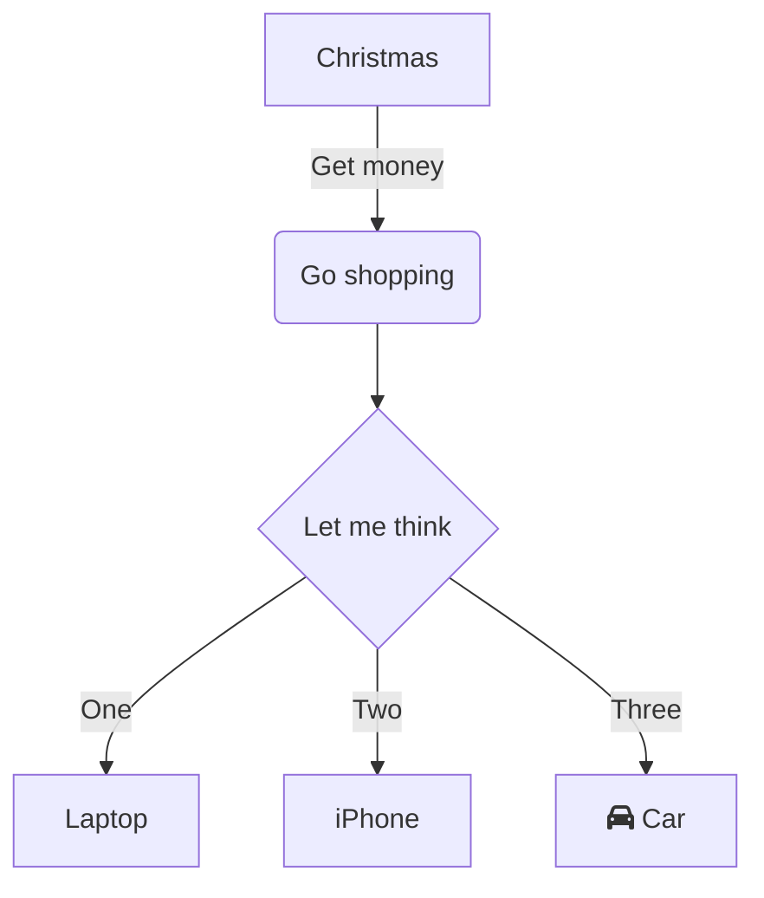

> This is a blockquote.

> > This is a nested blockquote.

> This is the first line of a blockquote.
>
> This is the second paragraph within the same blockquote.

> #### This is a Header inside a Blockquote
>
> - This is a list inside a blockquote
> - Another item

---
title: "Slide 1: Headings"
---

# Heading 1
## Heading 2
### Heading 3
#### Heading 4
##### Heading 5
###### Heading 6

---
title: "Slide 2: Text Styling"
---

**Bold Text**

*Italic Text*

~~Strikethrough~~

`Inline Code`

---
title: "Slide 3: Links and Images"
---

[Link](https://github.com)


---
title: "Slide 5: Code Blocks"
---

```dart
int factorial(int n) {
  if (n == 0) {
    return 1;
  } else {
    return n * factorial(n - 1);
  }
}
```

---
title: "Slide 6: Lists"
---

1. Ordered list item 1
2. Ordered list item 2

- Unordered list item 1
- Unordered list item 2

---
title: "Slide 7: Tables"
---

| Header 1 | Header 2 |
|----------|----------|
| Cell 1A  | Cell 1B  |
| Cell 2A  | Cell 2B  |

---
title: "Mermaid example"
---




---
title: "Slide 8: Task Lists"
---

- [ ] Task List Item 1
- [x] Task List Item 2

