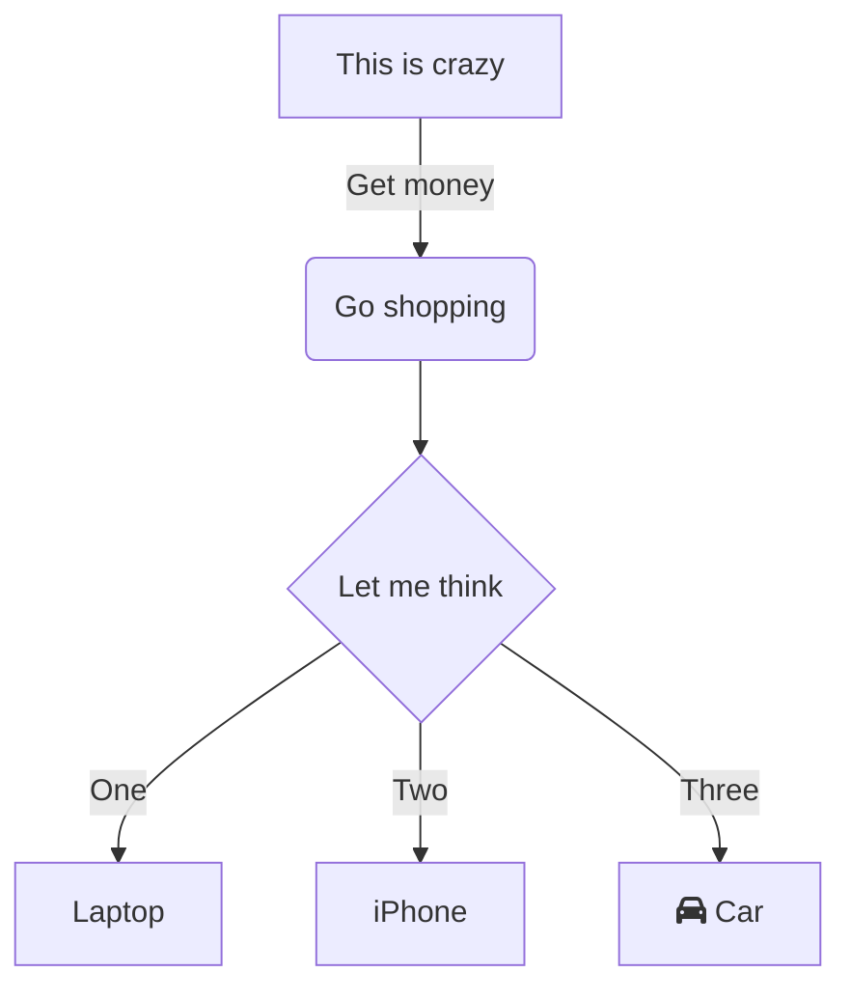

# Heading 1
## Heading 2
### Heading 3
#### Heading 4
##### Heading 5
###### Heading 6

**Paragraph**

Here is a paragraph with some text.


---
title: "Slide 2: Text Styling"
---

**Bold Text**

*Italic Text*

~~Strikethrough~~

`Inline Code`

---
title: "Slide 3: Links and Images"
---

[Link](https://github.com)


---
title: "Slide 4: Quotes"
---

> This is a blockquote.

> This is the first line of a blockquote.
>
>  This is the second paragraph within the same blockquote.

> #### This is a Header inside a Blockquote

---
title: "Slide 5: Code Blocks"
---

```dart {1, 3-8}
int factorial(int n) {
  if (n == 0) {
    return 1;
  } else {
    return n * factorial(n - 1);
  }
}
```

---
title: "Slide 6: Lists"
---

1. Ordered list item 1
2. Ordered list item 2

- Unordered list item 1
- Unordered list item 2

---
title: "Slide 7: Tables"
---

| Header 1 | Header 2 |
|----------|----------|
| Cell 1A  | Cell 1B  |
| Cell 2A  | Cell 2B  |

---
title: "Mermaid example"
---




---
title: "Slide 8: Task Lists"
layout: two-column
---

::left::

- [ ] Task List Item 1
- [x] Task List Item 2

::right::

#### Subtask

- [x] foo
  - [ ] bar
  - [x] baz
- [ ] bim

---
title: Dividers
---

_____
Dividers
____

---
title: Code rendering performance
---

```dart
class SyntaxTags {
  const SyntaxTags._();
  static final left = '::left::';
  static final right = '::right::';
  static final content = '::content::';
}

Map<String, List<String>> parseContentWithTags(
    String input, List<String> tags) {
  final Map<String, List<String>> parsedContent = {};
  int lastTagEndIndex = 0;
  String currentTag = SyntaxTags.content;

  for (int i = 0; i < input.length; i++) {
    for (String tag in tags) {
      if (input.substring(i).startsWith(tag)) {
        // Add the content before this tag to the list
        final content = input.substring(lastTagEndIndex, i).trim();
        if (content.isNotEmpty) {
          parsedContent.putIfAbsent(currentTag, () => []).add(content);
        }

        // Update the current tag and last tag end index
        currentTag = tag;
        lastTagEndIndex = i + tag.length;

        // Skip the characters of this tag
        i += tag.length - 1;
        break;
      }
    }
  }

  // Add remaining content if any
  if (lastTagEndIndex < input.length) {
    final content = input.substring(lastTagEndIndex).trim();
    if (content.isNotEmpty) {
      parsedContent.putIfAbsent(currentTag, () => []).add(content);
    }
  }

  return parsedContent;
}
```
