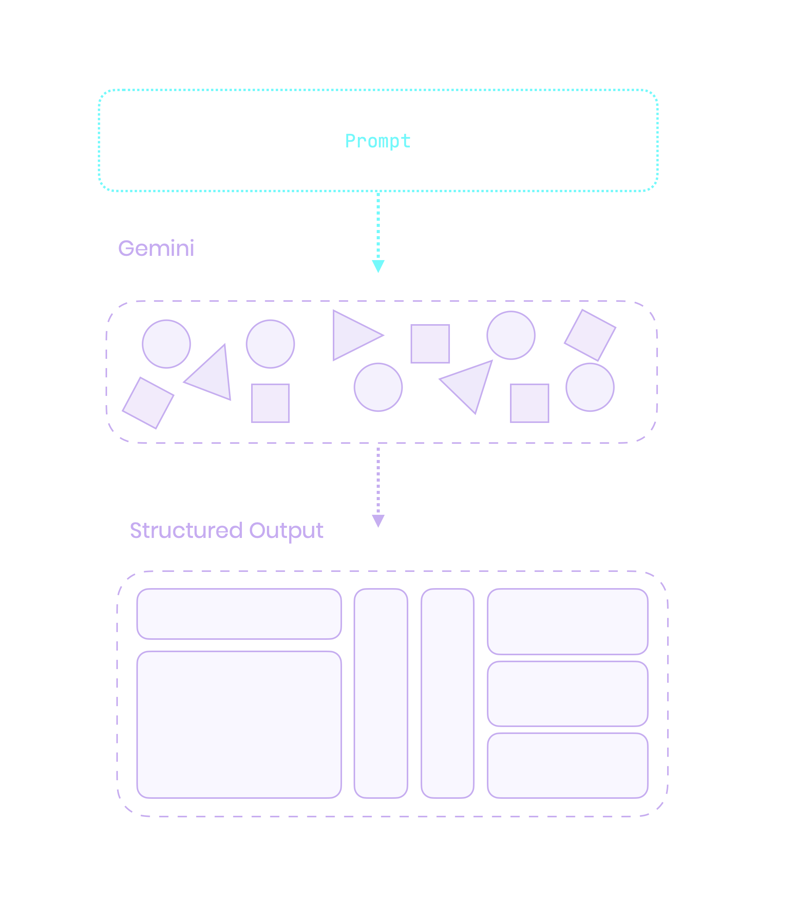
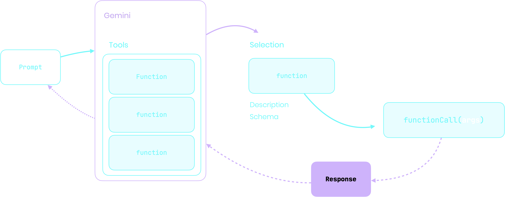
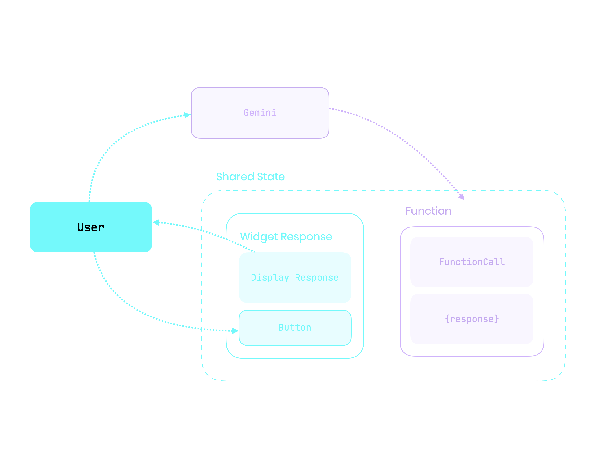

---

## How can LLMs Understtand Your UI?

{@column tag: image}


---

## Another image
{@column tag: image}


---

{@section flex: 2}
{@column
  align: center
  tag: heading
}
# Generative UI
# with Flutter

---

{@column
    align: center_right
}

#### Leo Farias
@leoafarias


{@column
    align: center_left
}

- Founder/CEO/CTO
- Open Source Contributor
- Flutter & Dart GDE
- Passionate about UI/UX/DX


---
{@column}

{@column 
  align: center_left 
  flex: 2
}
> [!WARNING]  
> This presentation contains live AI-generated content. Unexpected things may occur during the demonstration.

{@column}

---


{@column 
  flex: 2 
  align: center_right
}
### Generative UI
{@column}
## VS
{@column flex: 2}
### AI Assisted Code Generation

---


### What is Generative UI?

{@column}

- LLMs are great at generating content based on context
- GUIs are great at providing structured, interactive interfaces for user input and navigation

---

# LLM ❤️ GUI


---
{@column}
{@column
  flex: 2
  align: center
}
Creates dynamic, context-aware UIs by interpreting actions and maintaining state with LLMs for fluid, interactive responses.

{@column}

---

### Benefits of UI over Chat

- More intuitive and user-friendly, especially for complex tasks
- Faster feedback loop between users and LLMs
- Enhances efficiency and interaction

---


{@column
  flex: 3 
  align: center
}
### Flutter is Well-Suited <br>for Generative UI
Built for any screen: Ideal for generating<br>adaptive UIs across devices and platforms.
{@column}

---


## How can LLMs Understtand Your UI?

{@column tag: image}



---
{@column}

### Structured Output

{@column}
```dart
final schema = Schema.array(
  description: 'List of recipes',
  items: Schema.object(
    properties: {
      'recipeName': Schema.string(
        description: 'Name of the recipe.',
        nullable: false,
      ),
    },
    requiredProperties: ['recipeName'],
  ),
);
```

---
{@section}
```dart

final model = GenerativeModel(
  model: 'gemini-1.5-pro',
  apiKey: apiKey,
  generationConfig: GenerationConfig(
    responseMimeType: 'application/json',
    responseSchema: schema,
  ),
);

final prompt = 'List a few popular cookie recipes.';
final response = await model.generateContent([Content.text(prompt)]);

```

---

{@column}
### Color Palette Generator

Generate a color palette based on a given text.

- Name of the palette
- Font family
- Font color
- Color for each corner of the palette

--- 

{@column}
```dart
final schema = Schema.object(properties: {
  'name': Schema.string(
    description:
        'The text content to display on color palette. Format: #FF0000',
    nullable: false,
  ),
  'font': Schema.enumString(
    enumValues: ColorPaletteFontFamily.enumString,
    description: 'The font to use for the poster text.',
    nullable: false,
  ),
  'fontColor': Schema.string(
    description: 'The hex color value of the poster text. Format: #FF0000',
    nullable: false,
  ),
  'topLeftColor': Schema.string(
    description:
        'The hex color value top left corner of color palette. Format: #FF0000',
    nullable: false,
  ),
  'topRightColor': Schema.string(
    description:
        'The hex color value top right corner of color palette. Format: #FF0000',
    nullable: false,
  ),
  'bottomLeftColor': Schema.string(
    description:
        'The hex color value bottom left corner of color palette. Format: #FF0000',
    nullable: false,
  ),
  'bottomRightColor': Schema.string(
    description:
        'The hex color value bottom right corner of color palette. Format: #FF0000',
    nullable: false,
  )
}, requiredProperties: [
  'name',
  'font',
  'fontColor',
  'topLeftColor',
  'topRightColor',
  'bottomLeftColor',
  'bottomRightColor',
]);

```

---
style: demo
---

{@colorPalette
  type: schema
  prompts:
    - tropical
    - vibrant
    - pastel
    - chocolatey pink unicorn
    - cyberpunk
}

---
style: demo
---

{@colorPalette
  type: widget
  prompts:
    - tropical
    - vibrant
    - pastel
    - chocolatey pink unicorn
    - cyberpunk
}

---

## LLMs Orchestrate APIs

---

{@column 
  align: center_right
  tag: heading
  flex: 3
} 

### Gemini Function Calling
The Function Calling feature is in Beta release


{.cover}


---
style: demo
---

{@lightControl 
  type: schema
  prompts:
    - Dim the lights by 20
    - Increase by 35
    - Turn off the lights
    - Set it to 80
    - Lower by half
    - Max brightness
}

--- 

{@column 
  align: bottom_right
  tag: heading
  flex: 2
}

### User Interaction
Natural Language way to interact with an LLM

{@column
  tag: image
  flex: 4
}


---


{@column
  align: center_left
  tag: heading
}
### Widget Response

{@column 
  flex: 3
  tag: image
}



---
style: demo
---

{@lightControl
  type: widget
  prompts:
    - Dim the lights by 20
    - Increase by 35
    - Turn off the lights
    - Set it to 80
    - Lower by half
    - Max brightness
}

---

## What if the tool to use is a widget schema?

---

### Experimental

```dart
final schema = Schema.object(properties: {
  'textFields': Schema.array(
    description: 'A list of text fields',
    items: TextFieldSchemaDto.schema,
    nullable: true,
  ),
  'dropdowns': Schema.array(
    description: 'A list of dropdowns',
    items: DropdownSchemaDto.schema,
    nullable: true,
  ),
  'colorPickers': Schema.array(
    description: 'A list of colors pickers',
    items: ColorPickerDtoSchema.schema,
    nullable: true,
  ),
});

```

---
style: demo
---

{@widgetSchema
  type: widget
  prompts:
    - Change top colors
    - Change font
    - Change all colors
    - Change everything
}

---

## The future of UI might be orchestrating user experiences rather than creating it.

---

### Thank you

Leo Farias
@leoafarias
(GitHub, Twitter/X)
