```mermaid
sequenceDiagram
    participant Customer as 🧑 Customer
    participant Barista as ☕ Barista
    participant CoffeeMachine as 🏭 Coffee Machine
```

---
---
{@body}
{@content}
## This is an example of a widgets

{@widget name: demo }

---
---


{@content}




<!-- Notes go here -->

---
style: quote
---

{@content flex: 2}
> Create your Flutter presentations faster and easier than ever.
> You can quote me on that
> ### Leo 

{@content }


---
style: show_sections
---

{@header}
{@image src: https://picsum.photos/1200/1200?waves | align: bottom_left | fit: cover}

{@body flex: 2}
{@content flex: 2}
# Two Column HGoes here

This is a two-column layout. You can use it to compare two different concepts or ideas.


{@content}

### Section Options

Easily customize the content of each section to suit your needs.

Use front matter to define the layout of each section

---
style: show_sections
---

{@header}
{@content align: bottom_right}

## First

{@content}  


## Header

{@body flex: 2}

### Left Section
Easily customize the content of each section to suit your needs.

Use front matter to define the layout of each section

{@content}

#### Section Options

```yaml
sections:
  left:
    alignment: bottom_right
    flex: 2
  right:
    alignment: bottom_left
  header:
    alignment: bottom_left
```
 
