```mermaid
sequenceDiagram
    participant Customer as 🧑 Customer
    participant Barista as ☕ Barista
    participant CoffeeMachine as 🏭 Coffee Machine
```

---


{@section}
{@column align: top_left flex: 2 tag: supertag}
# This is a title

{@section flex: 2 }
{@column align: top_left}


> [!NOTE]  
> Highlights information that users should take into account, even when skimming.

> [!TIP]
> Optional information to help a user be more successful.

> [!IMPORTANT]  
> Crucial information necessary for users to succeed.

> [!WARNING]  
> Critical content demanding immediate user attention due to potential risks.

> [!CAUTION]
> Negative potential consequences of an action.

{@column}

```markdown

# Heading

## another


- List item 1
- List item 2
  - Sublist item 1
  - Sublist item 2

[Link to Google](https://www.google.com)


~~Strikethrough~~

`code`


> [!NOTE]  
> Highlights information that users should take into account, even when skimming.

> [!TIP]
> Optional information to help a user be more successful.

> [!IMPORTANT]  
> Crucial information necessary for users to succeed.

> [!WARNING]  
> Critical content demanding immediate user attention due to potential risks.

> [!CAUTION]
> Negative potential consequences of an action.

```


---
style: cover
background: https://picsum.photos/1400/1200?wavfeffsfffffccf
---

{@section}
{@column align: top_right flex: 2 tag: supertag}
# Change

{@section flex: 2 }
{@column align: top_left}
#### Unordered List

- first
- second
   - first
      - first
      - second

{@column}

#### Ordered List

### car


___

1. first
2. second
   1. first
      1. first
      2. second

{@column}

- George Washington
* John Adams
+ Thomas Jefferson


### Task List

- [x] Write the press release
- [ ] Update the website
- [ ] Contact the media


---

### Lists


{@column}



<!-- Notes go here -->

---


````mermaid
    xychart-beta
    title "Sales Revenue"
    x-axis [jan, feb, mar, apr, may, jun, jul, aug, sep, oct, nov, dec]
    y-axis "Revenue (in $)" 4000 --> 11000
    bar [5000, 6000, 7500, 8200, 9500, 10500, 11000, 10200, 9200, 8500, 7000, 6000]
    line [5000, 6000, 7500, 8200, 9500, 10500, 11000, 10200, 9200, 8500, 7000, 6000]
```

{@column}


---


---
style: custom
---


{@section}
{@column}
## This is an example of a widgets

{@widget name: demo tag: demo}

{@column}

```dart
import 'package:flutter/material.dart';

void main() {
  final style = Style(
    $box.padding.all(),
    $box.border.all(),
  );
}

```

---

{@section}
{@column flex: 1}

{@widget name: demo tag: demo}

{@column}


---
style: quote
---

{@section}
{@column align: bottom_right flex: 3}
# This presentation will be great

{@column}

{@section}


{@column }
{@column flex: 2 align: top_right}
> Create your Flutter presentations faster and easier than ever.
> You can quote me on that
> ### Leo 


---
style: show_sections
---

{@section}
{@image src: https://picsum.photos/200/1200?wafvfes align: top_left fit: cover}

{@section flex: 2}
{@column flex: 2}
# Two Column HGoes here

This is a two-column layout. You can use it to compare two different concepts or ideas.


{@column}

### Section Options

Easily customize the content of each section to suit your needs.

Use front matter to define the layout of each section

---
style: show_sections
---

{@section}
{@column align: bottom_right}

## First

{@column}  


## Header

{@section flex: 2}

### Left Section
Easily customize the content of each section to suit your needs.

Use front matter to define the layout of each section

{@column}

#### Section Options

```yaml
sections:
  left:
    alignment: bottom_right
    flex: 2
  right:
    alignment: bottom_left
  header:
    alignment: bottom_left
```
 
